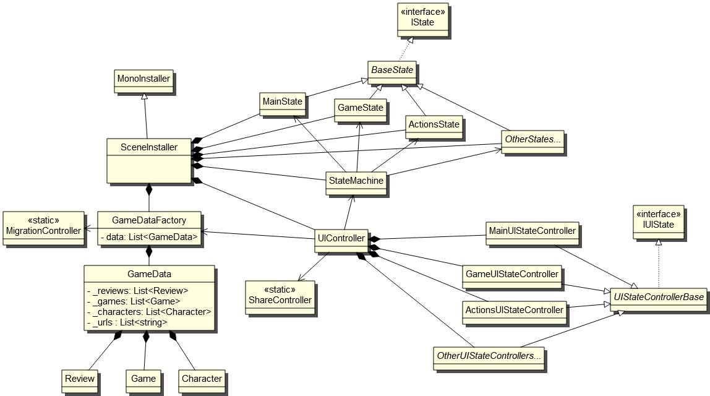

# Programmer Documentation

## Assests and Plugins
- Unity UI Toolkit
- [Zenject 9.2.0](https://github.com/modesttree/Zenject)
- [Unity Native File Picker v1.3.4](https://github.com/yasirkula/UnityNativeFilePicker)
- [Native Gallery for Android & iOS v1.8.1](https://github.com/yasirkula/UnityNativeGallery)
- [Native Share for Android & iOS v1.5.2](https://github.com/yasirkula/UnityNativeShare)
- [Newtonsoft Json 13.0.2](https://docs.unity3d.com/Packages/com.unity.nuget.newtonsoft-json@3.2/manual/index.html)

## Architecture

