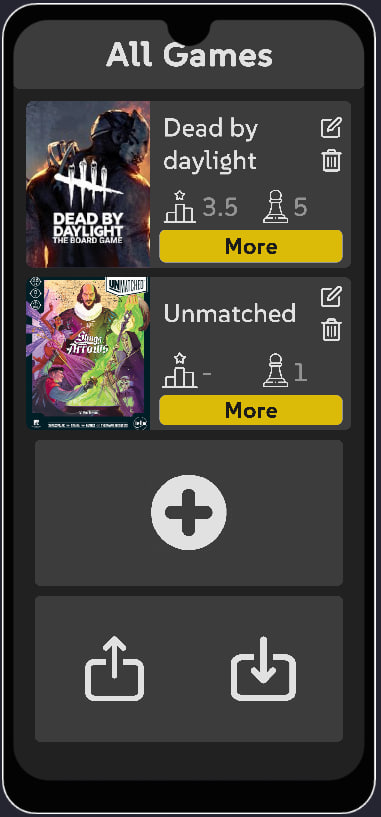
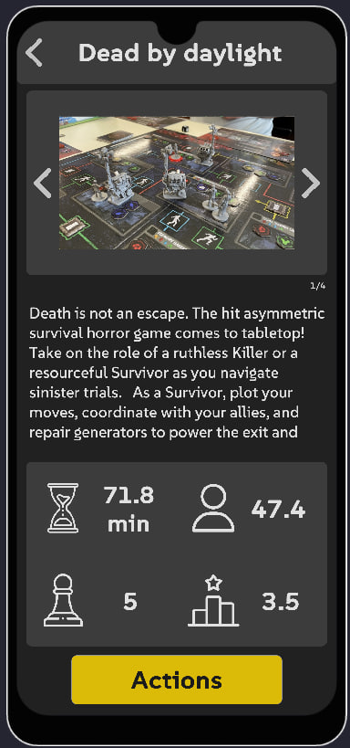

# User Documentation

## Startup

When you launch the app for the first time, a “Dead by daylight” game will be automatically created with characters and some URL pictures.

In other cases, when you exit/stop the application, the data will be saved and will be reloaded when you start the application again.

## Main menu

In the main menu you can see saved board games and buttons with the following functions.

Element with board game:

- Delete button - allows you to delete the game on this item
- Change button - allows you to change the game of this item
- "More" button - takes you to more detailed information about the game
- Star - shows the average value of ratings that have been saved in reviews
- Cube - shows the number of saved games in this board game

Other buttons:

- Plus button - adds a new game, after filling out the form
- Export button - allows you to send the saved data of your games in a special file to other users
- Import button - allows to load data from the selected file, the file must have the same format as the export file.

## Game Information menu

In the game information menu you can see information about the game, see pictures and read the description.

Key elements:
