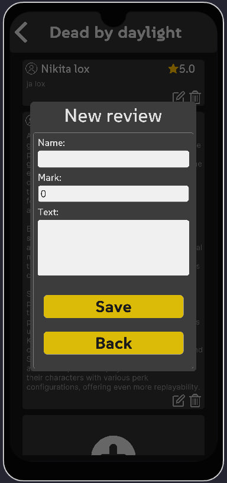
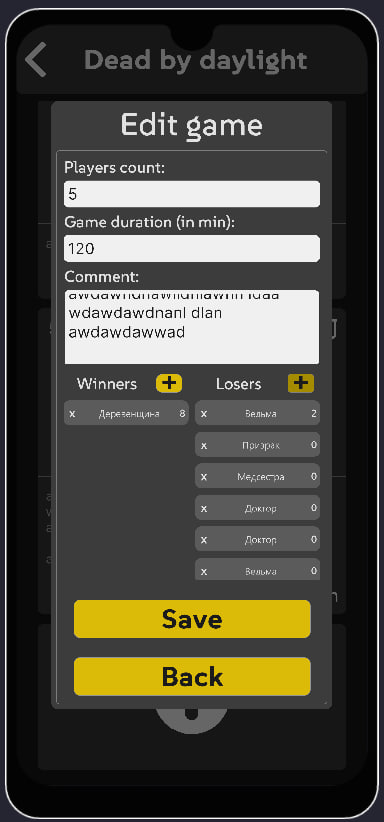
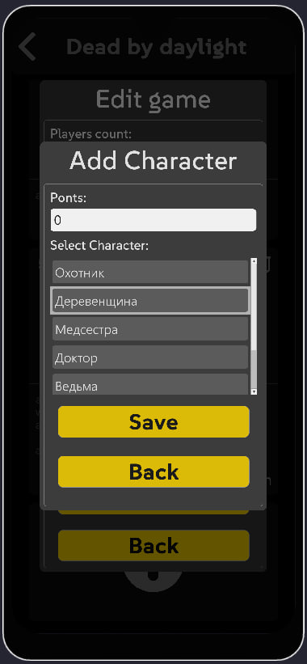
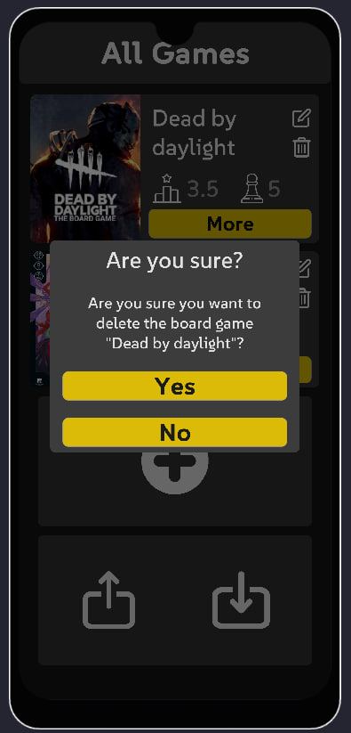
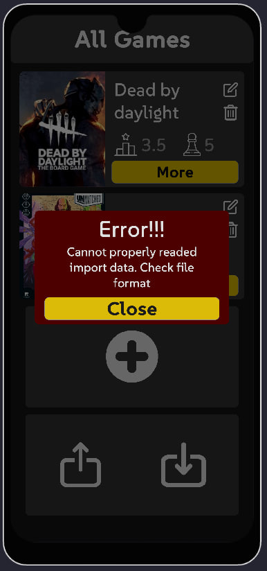

# User Documentation

## Startup

When you launch the app for the first time, a “Dead by daylight” game will be automatically created with characters and some URL pictures.

In other cases, when you exit/stop the application, the data will be saved and will be reloaded when you start the application again.

## Main menu

In the main menu you can see saved board games and buttons with the following functions.

Element with board game:
- Delete button - allows you to delete the game on this item
- Change button - allows you to change the game of this item
- "More" button - takes you to more detailed information about the game
- Star - shows the average value of ratings that have been saved in reviews
- Cube - shows the number of saved games in this board game

Other buttons:
- Plus button - adds a new game, after filling out the form
- Export button - allows you to send the saved data of your games in a special file to other users
- Import button - allows to load data from the selected file, the file must have the same format as the export file.

## Game Information menu

In the game information menu you can see information about the game, see pictures and read the description.

Key elements:
- A picture scroller that can be flipped with the left and right arrows. When the plus button appears and pressed, you can go to the picture editing menu.
- Statistics panel - brief statistics on the game, where the average game time (in minutes), the average number of players in the game, the number of games played, the average score according to player reviews.
- "Actions" button - takes you to the action menu.

## Picture editingn menu

Menu for editing the picture gallery for the game
When adding a new picture there is an opportunity to select an image from a local device, if you do not select anything, the element will be created empty. 

Key elements on the picture element:
- Input field - there you can insert a URL link and a picture will be automatically uploaded, in case the image from local storage was selected during creation, the path to this picture will be written in the input field.
- Delete picture - removes the element of the given picture from the gallery of pictures.
  
Other buttons:
- Plus button - add a new item with a picture.
- "Save" button - save changes and go back.
= "Back" button - returns to the previous menu and all changes are lost.

## Action menu

A panel for switching between the different action menus.

Buttons:
- "Reviews" button - goes to the reviews menu.
- "Games" button - goes to the games menu.
- "Characters" button - goes to the characters menu.

## Reviews menu

In the reviews menu, you can record player reviews with their comments and game rating (from 0.0 to 10.0).

Review element:
- Player name
- Player Rating (0.0 to 10.0)
- Delete Review
- Edit review
- User comment

Other buttons:
Plus button - add a new review, after filling out the form

## Form menu

Form menu - when creating or modifying some elements of the game, such as games, character reviews, etc. it is necessary to fill in the input fields and the corresponding information. Some fields are necessary, if you try to save with empty necessary fields, they will be highlighted in red color.
Example of a form for adding a review

Key elements:
- Name input field
- Grade input field
- Comment input field
- "Save" button - save changes and go back.
- "Back" button - returns to the previous menu and all changes are lost.

## Games menu

In the games menu you can store your games with information about how many players played, how many minutes the game lasted and which characters played and how many points they scored.

Game element:
- Game No.
- Number of players
- Game duration
- Delete Game
- Edit Game
- List of winners and losers
- The comment for the game

Other buttons:
- Plus button - add a new game, after filling out the form

## Games form menu

The menu of the form for adding/editing information about games played works on the same principle as other forms, but in this form there is also a possibility to add losers and winners of this game with their number of points.

Other buttons:
- Plus button - adds a character to a specific list once selected.

## Select character to game menu

In the character selection menu to add a character to the game, you have to choose a character from the list and write the number of points (can be 0)

Key elements:
- Number of points
- A list in which to choose a character
- "Save" button - add character and go back.
- "Back" button - returns to the previous menu without adding.

## Character menu

In the character menu, you can see the characters that can receive points in the game. Each item has statistics about the characters.

Character element:
- Character name
- Number of games
- Number of wins
- Average number of winning points
- Win percentage
- Delete Character
- Edit Character

Other buttons:
- Plus button - add a new сharacter, after filling out the form

## Import menu

The import menu is activated when the import file is loaded correctly. In this menu you can import new data about characters, games and heroes into existing games. If the game does not exist, it will be created.

Import element:
- Game name
- Toggle to import reviews
- Toggle to import games
- Toggle to import characters
- Toggle to import url images
- Toggle to import only the game, without internal data

Other buttons:
- "Save" button - adding data on selected conditions
- "Back" button - returns to the previous menu without adding.

## Error menu and confirmation menu

Confirmation menu occurs when deleting any difficult to return items such as games, reviews, characters, etc. After pressing confirm, the action ends.
The error menu appears when an error is received while the application is running.

